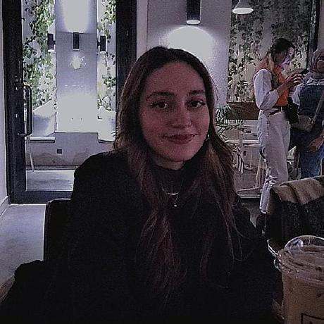
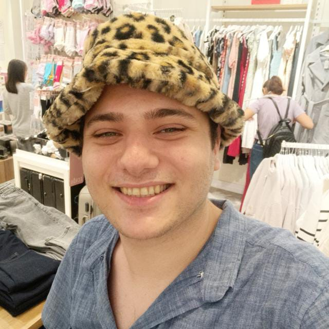
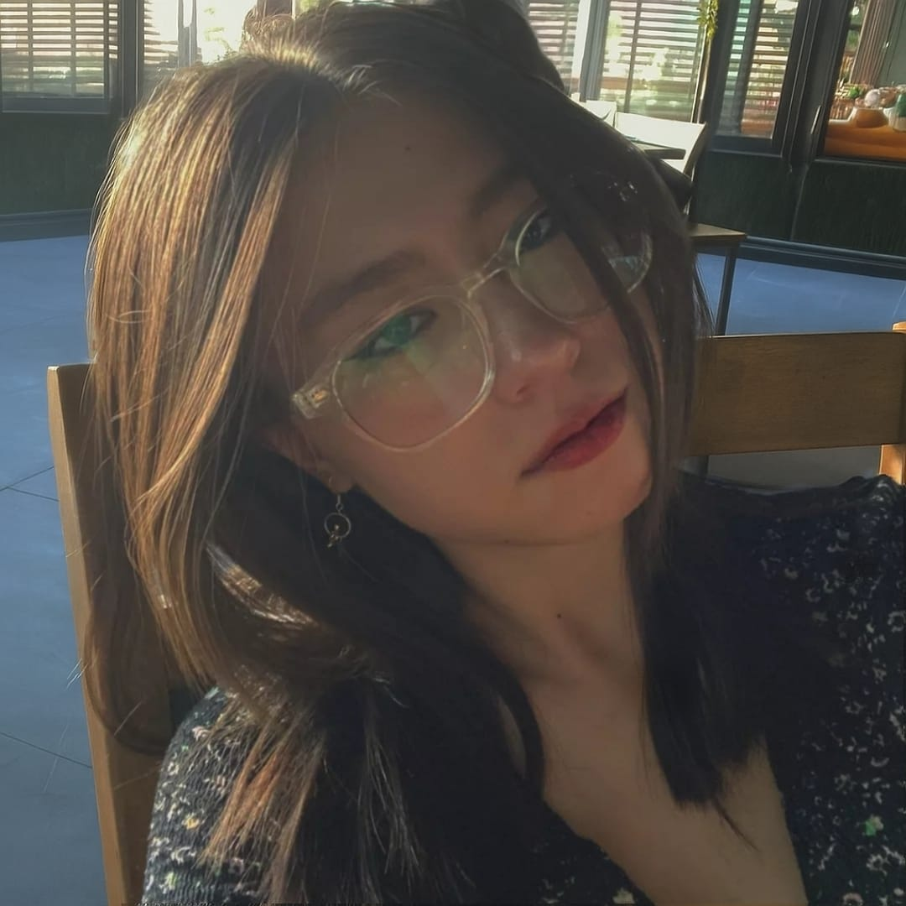
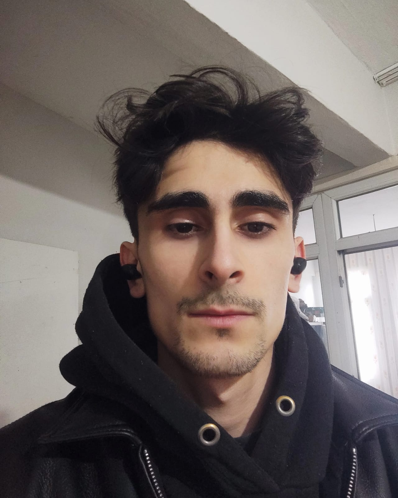
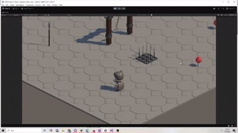

## 🏴‍☠️ **Takım İsmi**

**One Piece** 

## 🏴 **Takım Logosu**

## 👥 Takım Üyeleri

<table>
  <tr>
    <th></th>
    <th>Name</th>
    <th>Title</th>
    <th>Socials</th>
  </tr>
  <tr>
    <td></td>
    <td>Kutay Perk</td>
    <td>Product Owner</td>
    <td>
      
      
    </td>
  </tr>
  <tr>
    <td></td>
    <td>Melike Şahin</td>
    <td>Scrum Master</td>
    <td>
      
      
    </td>
  </tr>
  <tr>
    <td></td>
    <td>Mirza Özmen</td>
    <td>Game Developer</td>
    <td>
      
      
    </td>
  </tr>
  <tr>
    <td></td>
    <td>Ecenur Ektaş</td>
    <td>Game Developer</td>
    <td>
      
      
    </td>
  </tr>
  <tr>
    <td></td>
    <td>Harun Avaş</td>
    <td>Game Developer</td>
    <td>
      
      
    </td>
  </tr>
</table>

## 🎮 Oyun İsmi

**FUNGOR**

## 🧩 Oyun Logosu

## 📝 Oyun Açıklaması

**Fungor**, terk edilmiş bir zindanda mantar salgınının kaynağına doğru ilerleyen Arthur’un karanlık ve tehlikeli yolculuğunu konu alan, 3D izometrik rogue benzeri bir aksiyon-macera oyunudur.
Her denemede farklılaşan düşmanlar ve keşfedilecek sırlarla dolu zindan katmanlarında, hem hayatta kalmaya hem de kaçışın anahtarını bulmaya çalış!

## 📖 Oyun Hikayesi

Arthur eski bir zindanda bir mahkumdur. Zindanın derinliklerinde eski mahkumların çürümeye bırakılan cesetleri sebebiyle bir mantar salgını başlamış ve buradaki gardiyanlar kendi canlarını kurtarmak için zindanı terk etmişlerdir. Geride yalnızca Arthur ve yaşlı, unutulmuş bir adam kalmıştır. Bu yaşlı adam ne adını ne de geçmişini hatırlar ancak emin olduğu tek bir şey vardır: bu kabusun bitmesinin tek yolu zindanın derinliklerinde yatıyordur. Gücünü yitirmiş bu yaşlı adam, kaçamayacak kadar yaşlı olsa da, Arthur’a bir teklifte bulunur — birlikte çalışırlarsa, belki kurtuluş bir ihtimaldir.

Hayatta kalmak ve özgürlüğe ulaşmak için Arthur’un tehlikelerle dolu bu zindanın katmanlarında ilerlemesi, düşmanlarla yüzleşmesi ve gizemi çözmesi gerekmektedir. Her adımda yeni tehditler, her köşede yeni sırlar… Zindan seni yutmaya hazır. Peki ya sen çıkmaya hazır mısın?

## 🛠️ Oyun Özellikleri

- 3D Izometrik
- Tek Oyunuculu
- Action/Macera
- Rogue Benzeri

## 🎯 Hedef Kitle

- Rogue Benzeri Oyunlar severler
- Bağımsız (İndie) Oyun severler
- 15- 35 yaş arası oyuncular

## 📢 Pazarlama Planı

- Twitter/X, Instagram, TikTok’ta konsept çizimler ve geliştirici içerikleri paylaşmak.
- Discord sunucusu kurarak erken takipçilerle doğrudan iletişim kurmak.
- Steam Next Fest ve itch.io’da kısa bir demo yayımlayarak geri bildirim toplamak.
- Küçük-orta ölçekli yayıncılara erken sürüm sağlamak.
- #Fungor etiketiyle topluluğu içerik üretmeye teşvik etmek.
- Steam ve sosyal medya platformlarında fragmanla birlikte lansmanı duyurmak.

## 📌 Product Backlog URL

[Miro Backlog Board](https://miro.com/app/board/uXjVK7yGtNA=/)

---

# 🚀 Sprint 1

- **Sprint Notları**: User Story'ler product backlog'ların içine yazılmıştır. Product backlog item'lara tıklandığında hikayelerin detayları okunabilmektedir.

- **Sprint içinde tamamlanması tahmin edilen puan**: 100 Puan

- **Puan tamamlama mantığı**: Proje boyunca tamamlanması gereken toplam 300 puanlık backlog bulunmaktadır. 3 sprinte bölündüğünde ilk sprintin 100 ile başlaması gerektiği kararlaştırıldı.

- **Backlog düzeni ve Story seçimleri**: Backlog'umuz bir sonraki sprintlerin temelini atacak şekilde düzenlenmiştir. Sprint başına tahmin edilen puan sayısını geçmeyecek şekilde görevler dağıtılmıştır. Miro Board'da gözüken pembe item'lar _yazılım_, mor item'lar _ses_, açık yeşil item'lar _görsel efekt_, koyu yeşil item'lar _türü olmayan görevleri_ gösterirken, mavi item'lar _tasarım_ görevlerini temsil etmektedir. Sprint sonu günleri ekibin dinlenmesi amacıyla boş bırakılmıştır.

- **Daily Scrum**: Daily Scrum toplantılarının Discord üzerinden yapılması kararlaştırılmıştır. Daily Scrum toplantılarımız ve günlük Whatsapp konuşmalarımız Imgur'da toplanmıştır.: [Sprint 1 - Daily Scrum Chats](https://imgur.com/a/daily-scrum-chats-1-VpkQl6x)
- **Sprint 1 Board**: Sprint board screenshot: 

 
<h3>Oyun Durumu: Ekran Görüntüleri</h3>

  
  
   
  
  
  

  

- **Sprint Review**: 
  - Bütün ekip projede hangi kısımların bittiğini ve bunun hakkındaki görüşlerini iletti. Oyunun güncel tasarımının ve gidişatının beğenildiği belirtildi ve devamı üzerine yeni fikirler ortaya atıldı. Sprint içerisinde tasarlanmış olan level tüm ekip tarafından oynandı, herhangi bir sorun ile karşılaşılmadı.
  - Sprint Review katılımcıları: İsmail Dönmez, İncila Kırbaç, İbrahim Serhat Aktaş, İpek Nezihe Can, İrfan Şenatlı.

- **Sprint Retrospective:** 
  - Ekip iki gruba bölündü, bir grup oyunun kalan 4 bölümü üzerinde çalışarak ilerlemeye devam edecek; diğer ekip ise oluşturulan bölümlerin eksiklikleri üzerinde çalışacak ve oyunu final aşamasına hazır hale getirecek.
    - Grup 1: İsmail, İncila
    - Grup 2: İbrahim, İpek, İrfan
  - Toplantıların belirli bir zaman aralığıyla gerçekleştirilmesi kararlaştırıldı.
  - Üretim aşamasında görev alan ekip üyelerine gelecek bölümlerde ihtiyaç duyulabilecek assetlerin üretimi için listeler hazırlandı

